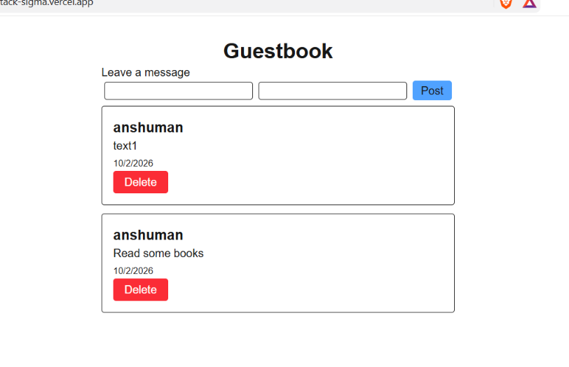

# GuestBook NextJS

In this project you can add a note and a name. It will show that in a list and you can delete it by pressing the delete button.

[Live Demo](https://nextjs-fullstack-sigma.vercel.app/)



## Features

- You can add a note with your name.

## Tech Stack

Built with NextJS.

## What I Learned

I don't know what I did. I know server component but don't really understand sever action and router handler.

## How to Run It Locally

```bash
git clone https://github.com/Anshuman56/nextjs-fullstack
cd nextjs-fullstack
npm install
.env.example MONGODB_URI=
npm run dev
```
